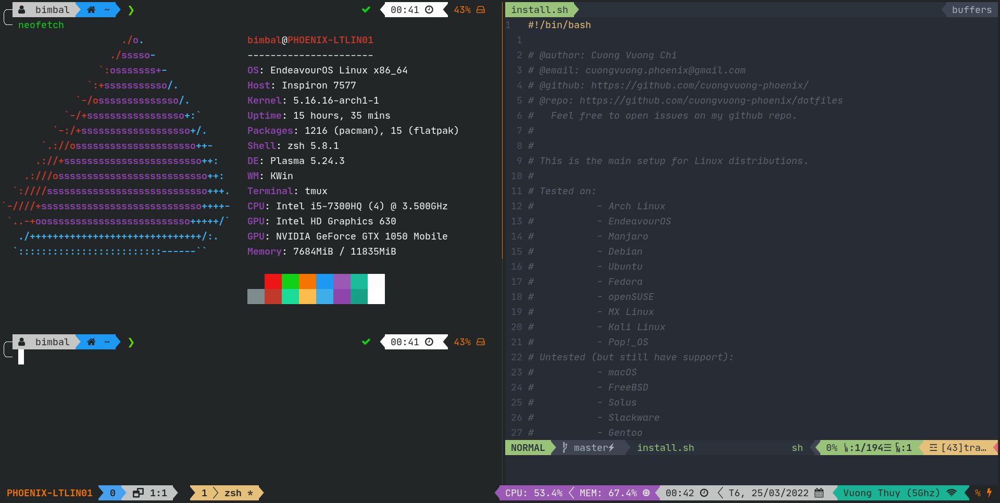

# Dotfiles

My personal **config files for Linux**.

## Introduction



This installation will not just **_symbolically link all config files to the right place_** but also **_install some packages by appropriate Package Manager_** of your distros.

Although I tried to calculate all possible failures could happen, you might still need to manually install packages or link config files again if something goes wrong.

> <u>**_Note_**</u>: All configs/enviroment in `~/.zshrc` (indentified by comments `#---- XYZ ----`) is specified for my usage. You can custom to fit your needs.

## List OS/Distros support

> **_Tested_**: Battle-tested with no errors. Just install and it should work out of the box!
> **_Untested_**: Not tested yet but still have support. If you're using one of these OS/distros, feel free to try installing and raise issues if you have any, I will try my best to fix it!

| **Tested**  | **Untested** |
| :---------: | :----------: |
| Arch Linux  |    macOS     |
|   Manjaro   |   FreeBSD    |
| EndeavourOS |    Solus     |
|   Debian    |  Slackware   |
|   Ubuntu    |    Gentoo    |
|   Fedora    |    CentOS    |
|  openSUSE   |   Mandriva   |
|  MX Linux   |  Void Linux  |
| Kali Linux  |              |
|  Pop!\_OS   |              |

## Prerequisties

**IMPORTANT**: If you come from a fresh distro, you might need to **update** (_e.g:_ `sudo apt update`,...) and **upgrade** (_e.g:_ `sudo apt upgrade`,...) all packages first, then install following packages if not exists:

- **bash** shell.
- [**tput**](https://command-not-found.com/tput).
- **git**. (You can download this repo as a _**zip**_ and then the installation will install **git** for you).
- [**asdf-vm**](https://asdf-vm.com/guide/getting-started.html).

## Installation

1. Clone the repository into `~/.dotfiles/`:

   ```shell
   git clone --depth=1 https://github.com/cuongvuong-phoenix/dotfiles.git $HOME/.dotfiles
   cd $HOME/.dotfiles
   ```

2. Run the installation script:

   ```shell
   ./install.sh
   ```

   - The installation will backup config file if it exists and is not linked to the correct place. All backup files are under `./BACKUP/<CURRENT DATE_TIME>/`.
   - Install any [Nerd Font](https://github.com/ryanoasis/nerd-fonts) and set it as default font for your _Terminal_ (I'm using _JetBrainsMono Nerd Font_).

## List of Packages

- **git**
  - [`~/.gitignore_global`](./git/.gitignore_global): typical `.gitignore` but is applied globally.
- **curl**
- **wget**
- **unzip**
- **fzf**
- **ripgrep**
- **fd**
- **bat**
  - [`~/.config/bat/config`](./.config/bat/config): configs for: theme, italic text.
- **jq**
- **sysstat**
- **neofetch**
- **alacritty**
  - [`~/.config/alacritty/alacritty.yml`](./.config/alacritty/alacritty.yml): configs for: theme, font, shortcuts, settings.
- **tmux**
  - [`~/.tmux.conf`](./terminal/.tmux.conf): configs for: theme, shortcuts (bindings), settings,...
- **neovim** _(get my configs [here](https://github.com/cuongvuong-phoenix/neovim-config))_
- **ibus**
  - Configs in [`~/.xprofile`](./others/.xprofile).
- **bash**
  - [`~/.bash_profile`](./shell/.bash_profile)
  - [`~/.bashrc`](./shell/.bashrc)
- **zsh**
  - [`~/.zprofile`](./shell/.zprofile)
  - [`~/.zshrc`](./shell/.zshrc)
  - [`~/.zshenv`](./shell/.zshenv)
  - **oh-my-zsh**
    - [autoupdate-zsh-plugin](https://github.com/TamCore/autoupdate-oh-my-zsh-plugins)
    - [zsh-autosuggestions](https://github.com/zsh-users/zsh-autosuggestions)
    - [zsh-syntax-highlighting](https://github.com/zsh-users/zsh-syntax-highlighting)
    - [powerlevel10k](https://github.com/romkatv/powerlevel10k)
  - [`~/.dir_colors`](./shell/.dir_colors)
- **openssh**
  - Generate new SSH key using `Ed25519` algorithm.
  - Add newly created key to the `ssh-agent`.
- **asdf-vm**
  - Install development tools specified in [`~/.tool-versions`](./others/.tool-versions)
