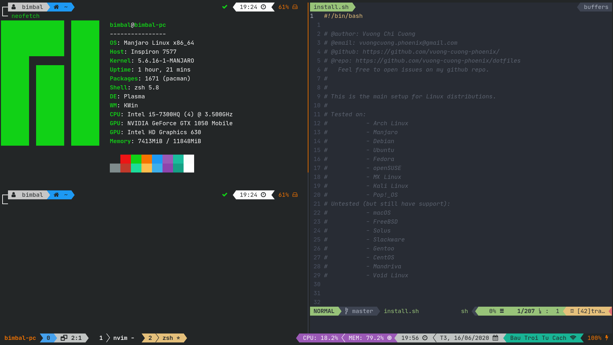

# Dotfiles

My personal **config files for Linux**.

## Table of Contents

1.  [Introduction](#introduction)

2.  [List Distros support](#list-osdistros-support)

3.  [Requirements](#requirements)

4.  [Installation](#installation)

5.  [List of Packages and Configurations](#list-of-packages-and-configurations)

6.  [Known Issues](#known-issues)

## Introduction



This installation will not just **_symbolically link all config files to the right place_** but also **_install some packages by appropriate Package Manager_** of your distros.

Although I tried to calculate all possible failures could happen, you still might need to manually install packages or link config files again if something goes wrong.

<u>**_Note_**</u>: All configs/enviroment in `~/.zshrc` (indentified by comments `#---- XYZ ----`) is specified for my usage. You can custom to fit your needs.

## List OS/Distros support

> **_Tested_**: Battle-tested with no errors. Just install and it should work out of the box!

> **_Untested_**: Not tested yet but still have support. If you're using one of these OS/distros, feel free to try installing and raise issues if you have any, I will try my best to fix it!

| **Tested** | **Untested** |
| :--------: | :----------: |
| Arch Linux |    macOS     |
|  Manjaro   |   FreeBSD    |
|   Debian   |    Solus     |
|   Ubuntu   |  Slackware   |
|   Fedora   |    Gentoo    |
|  openSUSE  |    CentOS    |
|  MX Linux  |   Mandriva   |
| Kali Linux |  Void Linux  |
|  Pop!\_OS  |              |

## Requirements

**IMPORTANT**: If you come from a fresh distro, you'll need to **update** (_e.g:_ `sudo apt update`,...) and **upgrade** (_e.g:_ `sudo apt upgrade`,...) all the packages first, then install requirements and follow the instruction below.

-   **bash shell**.
-   [**tput**](https://command-not-found.com/tput).
-   **git**. (You can download this repo as _**zip**_ and then the installation will install **git** for you).

## Installation

1.  Clone the repository into `~/.dotfiles/`:

    ```shell
    $ git clone --depth=1 https://github.com/vuong-cuong-phoenix/dotfiles.git $HOME/.dotfiles
    $ cd $HOME/.dotfiles
    ```

2.  Run this command:

    ```shell
    $ ./install.sh
    ```

    -   The installation will backup config file if it is exists and is not linked to the correct place. All backup files are under `./BACKUP/<CURRENT DATE_TIME>/`.
    -   If you haven't install `oh-my-zsh` before, then after the first time installation of it, you'll need to **run the command above again** to get effect of configurations.
    -   Install any [Nerd Font](https://github.com/ryanoasis/nerd-fonts) and set it as default font for your Terminal (I'm using _JetBrainsMono Nerd Font_).

3)  **_OPTIONAL_** (You may want to manually install these things to get the best experiment):
    -   **KDE** (If you are using _KDE_ desktop enviroment, install these scripts):
        -   [Move Window and focus to Desktop](https://store.kde.org/p/1296654)
    -   **Terminal themes**:
        -   Breeze Theme (currently my theme).
        -   Symphonic Theme.
        -   Brogrammer Theme.
        -   XTerm.
        -   Obsidian Theme.
        -   ... _(Any Dark themes)_

## List of Packages and Configurations

-   **git**
    -   _~~.gitconfig.static: [~/.gitconfig.static](./git/.gitconfig.static)~~ (Deprecated)_
    -   .gitignore_global: [~/.gitignore_global](./git/.gitignore_global)
-   **curl**
-   **wget**
-   **unzip**
-   **fzf**
-   **ripgrep**
-   **fd**
-   **bat**
    -   config: [~/.config/bat/config](./.config/bat/config)
-   **jq**
-   **sysstat**
-   **neofetch**
    -   config.conf [~/.config/neofetch/config.conf](./.config/neofetch/config.conf)
-   **tmux**
    -   .tmux.conf: [~/.tmux.conf](./terminal/.tmux.conf)
-   **neovim** _(get my full installation & configs [here](https://github.com/vuong-cuong-phoenix/neovim-config))_
-   **bash**
    -   .bash_profile: [~/.bash_profile](./shell/.bash_profile)
    -   .bashrc: [~/.bashrc](./shell/.bashrc)
-   **zsh**
    -   .zprofile: [~/.zprofile](./shell/.zprofile)
    -   .zshrc: [~/.zshrc](./shell/.zshrc)
    -   **oh-my-zsh**: `~/.oh-my-zsh`
        -   zsh-autosuggestions: `~/.oh-my-zsh/custom/plugins/zsh-autosuggestions`
        -   zsh-syntax-highlighting: `~/.oh-my-zsh/custom/plugins/zsh-syntax-highlighting`
        -   powerlevel10k: `~/.oh-my-zsh/custom/themes/powerlevel10k`
    -   DIR_COLORS: [~/.dir_colors](./shell/.dir_colors)
-   **firefox**
    -   `export GTK_USE_PORTAL=1` to `/etc/profile.d/mozilla-common-sh`
-   _**OPTIONAL**_ (You may want to manually install and configs these things):
    -   **alacritty** (_recommend_ using **alacritty-ligatures**)
        -   alacritty.yml: [~/.config/alacritty/alacritty.yml](./.config/alacritty/alacritty.yml)
    -   **kitty**
        -   kitty.conf: [~/.config/kitty/kitty.conf](./.config/kitty/kitty.conf)

## Known Issues

-   **(Solved)** Cannot find **Nerd Font** in **Gnome-Terminal**.
    **==>** By default, **Gnome-Terminal** only shows _monospace-fonts_.
    To choose **Nerd Font** as the default font for **Gnome-Terminal**, you need to install `dconf-editor`, then open it, find `/org/gnome/terminal/legacy/profiles:/<profiles-id>/font` and then change **_Custom value_** to `<font-name> <font-size>` (_e.g:_ `Hack Nerd Font 14`).  
    Or you can just run following commands:

    -   Find profile id:

    ```shell
    $ gsettings get org.gnome.Terminal.ProfilesList list
    ```

    Then you should see your profile's id list (example):

    ```shell
    ['b1dcc9dd-5262-4d8d-a863-c897e6d979b9', 'd2a064f8-146d-45b5-8da7-d7e2f34da77e']
    ```

    -   Set font for that profile (example):

    ```shell
    $ gsettings set org.gnome.Terminal.Legacy.Profile:/org/gnome/terminal/legacy/profiles:/:b1dcc9dd-5262-4d8d-a863-c897e6d979b9/ font 'Hack Nerd Font 14'
    ```
